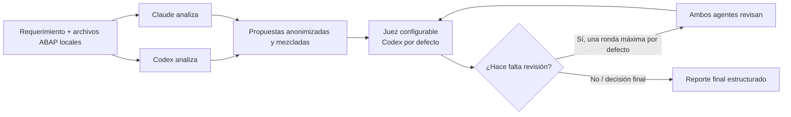

# Orquestador multiagente para revisión ABAP

CLI local que convierte un requerimiento y uno o varios archivos ABAP/SmartForm exportados en una recomendación técnica única, revisable y lista para llevar manualmente a SAP.

El problema que resuelve es simple: una revisión aislada puede omitir riesgos o proponer una solución débil. Este proyecto contrasta dos análisis independientes, elimina la identidad del proveedor antes de juzgarlos y entrega una síntesis final con consenso, riesgos y pruebas.

> No modifica objetos SAP, no crea transportes y no se conecta a SAP. El código se analiza desde archivos locales exportados.

## Inicio rápido

Requisitos:

- Node.js 18+ (validado con Node.js 24.19.0 y npm 11.17.0)
- Codex CLI y Claude Code CLI instalados y autenticados localmente

```powershell
cd <ruta-del-proyecto>
npm.cmd install
npm.cmd test
codex --version
claude --version
```

Para analizar un objeto ABAP, guarda el archivo en `abap/` (directorio ignorado por Git) y ejecuta:

```powershell
npm.cmd start -- --problem "En el método GET_ORDERS reemplaza el SELECT dentro del LOOP por una lectura masiva. Conserva el comportamiento funcional, evita SELECT FOR ALL ENTRIES si la tabla está vacía y devuelve el bloque ABAP completo compatible con S/4HANA." --file ".\abap\ZCL_ORDER_SERVICE.abap" --out "ajuste-get-orders.md"
```

El resultado queda en `reports\ajuste-get-orders.md`.

Si PowerShell bloquea `npm.ps1`, utiliza `npm.cmd` como en los ejemplos o ejecuta `Set-ExecutionPolicy -Scope Process Bypass` solo en la ventana actual.

Para el paso a paso completo de uso local con archivos ABAP, consulta [GUIA_LOCAL.md](GUIA_LOCAL.md).

## How it works



1. Codex y Claude analizan en paralelo el mismo requerimiento y contexto.
2. Sus respuestas pasan al juez como `PROPUESTA A` y `PROPUESTA B`, en orden aleatorio y sin identidad de proveedor.
3. El juez puede solicitar una ronda adicional de revisión cuando detecta una respuesta vacía o desacuerdos materiales.
4. El reporte conserva la respuesta final, consenso, desacuerdos relevantes, rationale, riesgos y pruebas sugeridas.

## Key features

- Especializado en revisión y propuesta de ajustes ABAP.
- Dos análisis independientes ejecutados en paralelo.
- Anonimización, mezcla de orden y juez configurable (`codex` o `claude`).
- Consenso iterativo acotado para evitar ciclos infinitos.
- Reportes Markdown estructurados bajo `reports/`.
- Límites configurables de contexto, prompt, salida y tiempo de ejecución.
- Diagnósticos de errores de inicio, timeout, señal y código de salida.
- Pruebas unitarias con Node.js integrado.

## Architecture

| Módulo | Responsabilidad |
| --- | --- |
| `src/index.ts` | Orquesta análisis paralelos, revisión opcional, juez y reporte final. |
| `src/agents/CommandAgent.ts` | Ejecuta CLIs con timeout, límites de salida y manejo de procesos. |
| `src/agents/CodexAgent.ts` | Resuelve e invoca Codex CLI en modo de solo lectura. |
| `src/agents/ClaudeAgent.ts` | Configura Claude Code CLI para análisis sin herramientas. |
| `src/consensus/ConsensusAgent.ts` | Construye prompts, anonimiza propuestas, mezcla su orden y extrae secciones del juez. |
| `src/input/ContextLoader.ts` | Carga archivos locales y limita el contexto enviado a los agentes. |
| `src/input/CliOptions.ts` | Valida argumentos y variables de entorno. |
| `src/output/ReportWriter.ts` | Escribe el reporte final y registros de depuración. |

## Ejemplo de salida final

```markdown
## Respuesta final

Sustituye el `SELECT` dentro del `LOOP` por una consulta masiva a `VBAK`,
validando que la tabla de claves no esté vacía. El bloque propuesto conserva
la semántica actual y evita lecturas repetidas de base de datos.

## Riesgos restantes

- Verificar el release ABAP objetivo antes de usar expresiones de tabla.
- Probar pedidos sin cabecera y tablas de entrada vacías.
```

## Uso con varios archivos

Repite `--file` cuando el cambio incluye una clase, una interfaz, un programa o un SmartForm.

```powershell
npm.cmd start -- --problem "Ajusta el flujo de validación y devuelve los cambios ABAP por objeto, con orden de activación y pruebas." --file ".\abap\ZCL_ORDER_SERVICE.abap" --file ".\abap\ZIF_ORDER_SERVICE.abap" --file ".\abap\ZORDER_REPORT.abap" --out "ajuste-validacion.md"
```

### Plantilla de requerimiento

```text
En el método <MÉTODO> de <OBJETO>, necesito <CAMBIO>.
Conserva <REGLAS DE NEGOCIO>.
Compatible con <RELEASE/S4HANA/ECC>.
Devuelve el bloque ABAP completo que debo reemplazar, riesgos y pruebas.
```

## Configuración

| Variable | Valor por defecto | Descripción |
| --- | --- | --- |
| `JUDGE_PROVIDER` | `codex` | Juez: `codex` o `claude`. |
| `AGENT_TIMEOUT_MS` | `180000` | Tiempo máximo por ejecución de agente. |
| `MAX_CONTEXT_CHARS` | `12000` | Máximo de caracteres de archivos de entrada. |
| `MAX_PROMPT_CHARS` | `30000` | Máximo de caracteres por prompt. |
| `MAX_AGENT_OUTPUT_CHARS` | `1000000` | Máximo capturado por `stdout` o `stderr` de cada agente. |
| `MAX_CONSENSUS_ROUNDS` | `1` | Máximo de rondas adicionales solicitadas por el juez. |
| `CODEX_COMMAND` / `CLAUDE_COMMAND` | — | Ejecutable o ruta local del CLI. |

En Windows, Codex prioriza `CODEX_COMMAND`, después el ejecutable disponible en `PATH` y finalmente la extensión de VS Code. Los valores de comando rechazan comillas, saltos de línea y metacaracteres de shell.

## Security & Privacy

- Codex se ejecuta con `--sandbox read-only`.
- Claude se ejecuta con `--tools ""` y `--permission-mode plan`.
- El programa no ejecuta comandos sugeridos por los LLM ni concede permisos de escritura a los agentes.
- No utiliza OpenAI API, Anthropic API, API keys ni claves de pago; los CLIs usan sesiones autenticadas localmente.
- Los archivos de entrada se marcan como contenido no confiable en los prompts.
- `abap/`, `reports/`, `runs/`, `dist/`, `node_modules/` y `.env` están ignorados por Git.
- No incluyas secretos en prompts, nombres de archivo ni commits.

## Desarrollo

El proyecto usa TypeScript 5.9.3, `@types/node` 22.20.1 y resolución de módulos `Node16`.

```powershell
npm.cmd test
```

La suite valida argumentos, límites de prompt, configuración del juez, anonimización y ejecución directa de procesos en Windows.

## Roadmap

- Integración opcional con Gemini CLI.
- Análisis de repositorios ABAP completos con selección de archivos y contexto incremental.
- Proveedores y políticas de juez adicionales.
- Interfaz gráfica local para cargar archivos, ejecutar revisiones y comparar reportes.
- Exportación de reportes a formatos adicionales.

## Licencia

Distribuido bajo la [licencia MIT](LICENSE).
